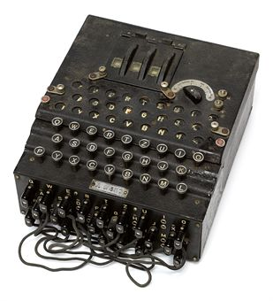

The Enigma
===========

.. index::
   single: Alan Turing
   single: Enigma
   single: World War II
   single: Bletchley Park

*Enigma* was the name of a cryptographic typewriter-like machine that
was used by Germany before and during World War II.  German military
commanders used the Enigma to encrypt instructions sent by radio to
their commanders across Europe and the Atlantic ocean. The Allies
could eavesdrop on the radio transmissions and hear the encrypted
messages, but without the key used for that day, they couldn't decrypt
them.  A top-secret team of mathematicians were gathered in Bletchley
Park, in England, with the task of breaking the Enigma. The team's
intellectual leader was a young man named Alan Turing.  The story of
how the Enigma was broken is told pretty well in the movie *The
Imitation Game*, and even better (but without Benedict Cumberbatch) in
the book *Alan Turing: The Enigma* by Alan Hodges.  Alan Turing's life
ended tragically due to how homosexual people were treated. The
British government issued a formal pardon and apology in 2013.  In
addition to ending WWII early, Alan Turing is credited with inventing
the modern computer, and artificial intelligence.

In this chapter you will learn how to use a cardboard model of the
Enigma that works exactly like the original. Then, step by step, we'll
implement the Enigma in Cryptol, and use it to encode and decode
messages.

.. finally, we'll use Cryptol's advanced features to break the enigma code.

Using a real Enigma
-------------------

If you ever get a chance to visit the National Cryptologic Museum\ [#]_, you
can use a real Enigma machine. Here's what you would do to encrypt
something with a real Enigma machine.

.. [#] The National Cryptologic Museum is next to Fort Meade, in
   Maryland, where the US National Security Agency is located. It's well worth
   visiting. It's about halfway between Washington, D.C, and
   Baltimore.

First, the key is the combination of two things: the *rotor settings*
and the *plugboard settings*. The rotors are the wheels at the top of
the machine. Choose a set of initial positions and write them down.
You probably will not be able to change the plugboard settings, but
write them down (or take a photo) if you can. After you configure the key, then you
start typing your message. As you type, the machinery moves, and
lights up letters in the area above the keyboard. As you type the
message, a partner writes down the sequences of lit-up letters. This
is the encrypted message. As you type, the rotors change positions, so
if you want to immediately decode the message, you'll need to reset
the rotor, then you start typing in the ciphertext. If things are
working right, the plaintext of your message will show up in the
lights.

Making and using your own Enigma
---------------------------------

Franklin Heath, a cybersecurity company in the UK, released an
excellent cardboard model of the Enigma. It is similar to a
pen-and-paper version of the Enigma designed by Alan Turing while he
was at Bletchley Park, and can be used to encrypt and decrypt messages
interchangeably with real Enigma machines.

The first thing you'll need to assemble your own paper Enigma is a
tube that has a diameter of 75mm. One source of such tubes is
Pringles cans (they call them "crisp tubes" in Britain). If you don't
want to buy a can of Pringles, you can make your own tube from
cereal box cardboard.

Let's build our paper Enigma step by step, and write Cryptol code that
simulates the system at each step.

Following the directions on the Franklin Heath paper Enigma wiki,
build the most simple Enigma, which has three paper bands: the
Input/Output band, Rotor I, and Reflector B. Make sure to line up the
gray bar on the Reflector and the I/O band, and tape those bands
stationary, while allowing the rotor to move. The key in this Simple
Enigma is the letter between the gray bars when you start. Before
decoding each character, slide the rotor toward you one position, so
the next higher letter in the alphabet is between the grey bars.

.. figure:: figures/OneRotorPaperEnigma.jpg
   :alt: Paper Enigma with one rotor
   :figclass: align-center
   :scale: 60%

   Paper Enigma with one rotor

Using this one-rotor setup, set the key to A, and decode the following
message:

..

  ``Y M X O V P E``

The result should be two English words\ [#]_.

.. [#] If the answer doesn't look right, and starts with ``P``, then
   you forgot to advance the rotor *before* decoding each letter.

Implementing the Enigma in Cryptol
-----------------------------------

The Enigma is considerably more complicated than the Caesar or
Vigenère ciphers. We can't just implement it in one go - instead we
have to break it up into the various components and test each step as
we go. We'll start by implementing just the rotor, then the reflector,
then combine them into a one-rotor Enigma, and so on. Let's go!

Implementing Enigma rotors in Cryptol
~~~~~~~~~~~~~~~~~~~~~~~~~~~~~~~~~~~~~~

If you think about what the Enigma rotor does, it takes a letter as input
and produces a different letter as output. If you put the rotor's A
between the grey bars, you can trace out what each letter gets
transformed to. For example, A from the I/O band goes up to E, and B
goes to K.

If we want to express this in Cryptol, a sequence of letters
that are the result of translating ``A`` :math:`\rightarrow` ``Z`` looks like this:

.. code-block:: console

  alphabet = "ABCDEFGHIJKLMNOPQRSTUVWXYZ"
  rotorI   = "EKMFLGDQVZNTOWYHXUSPAIBRCJ"

.. index:: index operator
To use the rotor encoded like this, all we need is the *index
operator*, which is ``@``. To transform the letter ``C`` with the
rotor, we first get the index of ``C`` in the alphabet using
``asciiToIndex``, then we use that index on the ``rotorI`` sequence,
like this:

.. code-block:: console

  Cryptol> let i = asciiToIndex 'C'
  Cryptol> rotorI@i
  'M'

If you got a hex result instead, don't forget to ``:set ascii=on``.

.. index:: self-inverting function
Note that the rotor's function is not *self-inverting.* What this means
is that if ``C`` goes to ``M``, ``M`` does not go to ``C`` (in this case, it goes to
``O``.

Implementing the reflector in Cryptol
~~~~~~~~~~~~~~~~~~~~~~~~~~~~~~~~~~~~~

Now let's look at the Reflector. In this case what the reflector does *is*
self-inverting. The reflector connects, for example, A and Y. So A
input produces Y as output, and Y input produces A as output.

Come up with the Cryptol string that represents the Reflector's
actions. It should start like this:

.. answer: "ABCDEFGHIJKLMNOPQRSTUVWXYZ"
   "YRUHQSLDPXNGOKMIEBFZCWVJAT"

.. code-block:: console

  reflectorB = "YRU // ... you finish the rest

In the initial setting with the rotor's ``A`` between the grey bars, we
use the reflector exactly the same way we used the rotor. In this
example, we've placed the call to ``asciiToIndex`` as the argument to
the index operator:

.. code-block:: console

  Cryptol> reflector @ (asciiToIndex 'C')
  'U'
  Cryptol> reflector @ (asciiToIndex 'U')
  'C'

Here we see that the reflector transforms ``C`` to ``U``, and because
it's self-inverting, ``U`` transforms to ``C``.
There were multiple versions of the Enigma through the years.
In one version, the reflector was fixed to the rotor next to it, and
rotated along with it. In that version, we're done. Most of the
historical Enigma messages were encoded with a version in which the
reflector is stationary as the rotor advances. The next section
describes how to implement the stationary rotor.

Implementing a stationary reflector
~~~~~~~~~~~~~~~~~~~~~~~~~~~~~~~~~~~

Set your paper Enigma's rotor so that ``A`` is between the grey bars.
It's easy to see that ``A`` goes to ``Y``. If you advance the rotor
one step (so that ``B`` is between the grey bars), now ``B`` goes to
``Z``. If we look at our reflector string, you'll see that there is no way to
implement rotor advancement as a string rotation like we did with the
rotor. Advancing the rotor totally scrambles what the reflector does,
which is probably why the designers of the Enigma introduced this
feature.

Instead, we need to think about the elements of the rotor as *offsets*
-- values to add to the input character. We can calculate the offsets
from our initial rotor string with a simple Cryptol function:

.. code-block:: cryptol

  getReflectorOffsets reflector = [ (26 + r - c) % 26
                                  | c <- alphabet
                                  | r <- reflector ]

  reflectorBo = getReflectorOffsets reflectorB

.. index:: modulo arithmetic
To understanding what's going on here, we need to revisit *modulo
arithmetic*. In Chapter 4, we mentioned that our 12-hour timekeeping
system is a common example of modulo arithmetic: the hour past 12 is 1
again. When mathematicians (and cryptographers) do modulo arithmetic,
we start with zero instead of one, just like zero-based indexing
(discussed in Chapter 3).

Since our Enigma has an alphabet with 26 items, that means valid
indexes go from 0 to 25. Returning to our reflector, if you think
about what it does as adding offsets, it makes sense to do that
addition *modulo 26*, so if the addition goes higher than 25, it will
*wrap around* back to zero, and the index will still be valid. For
example, with our rotor back in position ``A``, looking at ``Y`` (at
index 24), you could say the reflector *adds 2, modulo 26*. Adding one
gets us to 25, then adding another 1 wraps around to 0, which is the
index of ``A``.

We're ready to understand the Cryptol code above. The first line does
all the interesting work: it says that each offset is ``(26 + r - c) % 26``.
``r`` is our reflector value, and ``c`` is the current
character in ``A .. Z``. Subtracting them gets the offset we're after.
So why do we add 26? The reason is that Crytpol only supports
non-negative numbers. So, to make this work, we
add 26 before subtracting ``c``. Since adding 26 (modulo 26) is the same as
adding 0, it doesn't change the answer, and keeps things positive
where we need them.

Now that we have the offsets array, we can apply the rotor like this:

.. code-block:: cryptol

  // takes a sequence of reflector offsets
  // and a character, and returns the
  // transformed character
  doReflector r c = c' where
    ci = asciiToIndex c
    ci' = (ci + r@ci) % 26
    c' = indexToAscii ci'

Get out your paper Enigma, and test it with some inputs:

.. code-block:: console

  % cryptol enigma.cry

                          _        _
     ___ _ __ _   _ _ __ | |_ ___ | |
    / __| '__| | | | '_ \| __/ _ \| |
   | (__| |  | |_| | |_) | || (_) | |
    \___|_|   \__, | .__/ \__\___/|_|
              |___/|_|  version 2.4.0

  Loading module Cryptol
  Loading module Main
  Main> :set ascii=on
  Main> doReflector reflectorBo 'A'
  'Y'
  Main> doReflector (reflectorBo >>> 1) 'A'
  'U'
  Main> doReflector (reflectorBo >>> 1) 'B'
  'Z'

In the example, we see that ``A`` :math:`\rightarrow` ``Z``, which is
as expected. Then if we advance the rotor by one, we need to rotate
the reflector the other direction by one, to compensate for the
rotor's motion, allowing the reflector to remain fixed. With that
setting, we see that 
``A`` :math:`\rightarrow` ``U``, and
``B`` :math:`\rightarrow` ``Z`` as expected! Check this with your own
paper Enigma.

Running the rotor backwards
~~~~~~~~~~~~~~~~~~~~~~~~~~~~~~~~

Finally, we need to consider that the lines you trace go first from
right-to-left, go through the reflector, and then back through the
rotor go left-to-right. So looking at Rotor I again, if you start at
the letters on the left side of the ring, and trace them to the I/O
band, they start with ``A`` goes to ``U``, ``B`` goes to ``W``, and so on.

We could go through, one by one, and produce another string that
represents the backwards transformation. However, we have the
information we want already in the previous RotorI string. Look at
this:

.. code-block:: console

  alphabet = "ABCDEFGHIJKLMNOPQRSTUVWXYZ"
  rotorI   = "EKMFLGDQVZNTOWYHXUSPAIBRCJ"
              ^- shows E -> A     ^- shows A -> U

If we look at the letters in the ``rotorI`` string, we see that it
tells us the backwards-mapping too - because ``E`` is in the first
position, that tells us that ``E`` :math:`\rightarrow` ``A``. Because ``K`` is in the
second position, we know ``K`` :math:`\rightarrow` ``B``. We can follow this pattern to
automate the process of reversing this operation in Cryptol! It's a
bit tricky, so we'll go carefully:

.. code-block:: cryptol
  :linenos:

  indexOf c shuffle = candidates ! 0 where
      candidates = [ -1 ] # [ if c == s then i else p
                            | s <- shuffle
                            | p <- candidates
                            | i <- [ 0 .. 25 ]
                            ]

.. index::
   single: recursion
   single: sequence comprehension
The first function we want is one that gives us the index of a
character in a shuffled string. Line 1 defines our function, and says
that it returns the last item of a sequence called ``candidates``. The
``where`` says we're about to define some variables (in this case only
one). Line 2 says that candidates is a sequence that starts off by
concatenating the sequence of one element (``[-1]``) with a *sequence
comprehension* (remember those from Chapter 3?). Each element of the
sequence is the result of an if statement: if ``c == s`` it's ``i``
otherwise it's ``p``. We don't yet know what any of those variables
(except ``c``) is yet, but fear not: they're defined right below. Line
3 says that ``s`` *is drawn from the elements of shuffle*. So each
time through the loop, ``s`` is the next element of the shuffle. Line
4 says that ``p`` is drawn from the elements of the ``candidates``
sequence. Interesting: We're using the sequence in the definition of
itself! Just like in Chapter 3, this is an instance of *recursion*.
Finally, line 5 says that ``i`` is drawn from the sequence ``[0..25]``.

When this function runs, it builds up the ``candidates`` sequence,
starting with ``-1``, each element keeps being set to ``p`` (which
starts out with ``-1``) until the letter from shuffle being examined,
called ``s`` is equal to ``c``, the letter we're searching for. When
that happens, the new element of ``candidates`` gets set to ``i``,
which is the index of the match, because the numbers ``0 .. 25`` are the
indexes of the elements of shuffled sequence.

Here are the values of candidates as it proceeds through the shuffled
list, with the call ``findIndex 'L' rotorI``:

.. code-block:: console

   c: 'L'
   i:           [ 0,  1,  2,  3,  4,  5,  6, .., 25 ]
   candidates = [-1, -1, -1, -1,  4,  4,  4, .., 4  ]
   s:             E   K   M   F   L   G   D  ... J
                                  ^
   note:             s == 'L' here|, so the index i
                     is saved to candidates

With this function, we can create the left-to-right version of a rotor
given its right-to-left version:

.. code-block:: cryptol

  invertShuffle shuffle = [ alphabet @ (indexOf c shuffle)
                          | c <- alphabet
                          ]

Save these functions and the definition of ``rotorI``, ``reflectorB`` and
``alphabet`` to a file called ``enigma.cry``, and run Cryptol on it:

.. code-block:: console

  $ cryptol enigma.cry
                          _        _
     ___ _ __ _   _ _ __ | |_ ___ | |
    / __| '__| | | | '_ \| __/ _ \| |
   | (__| |  | |_| | |_) | || (_) | |
    \___|_|   \__, | .__/ \__\___/|_|
              |___/|_|  version 2.4.0

  Loading module Cryptol
  Loading module Main
  Main> :set ascii=on
  Main> let rotorIrev = invertShuffle rotorI
  Assuming a = 7
  "UWYGADFPVZBECKMTHXSLRINQOJ"
  Main> rotorIrev @ asciiToIndex 'C'
  'Y'

Indeed, going from left-to-right (backwards), ``C`` goes to ``Y``.
Pretty cool, isn't it? We worked hard to write this code to save us the hassle of
manually tracing the letters backwards. The benefit of doing it this
way instead of by hand is that we have confidence that the
backwards version of the rotors is actually correct. A single typo in
the string would result in an error that would be really hard to track
down.

.. In a future chapter, we'll learn how to use Cryptol to prove
   properties about our rotors, such as that they are permutations of the
   alphabet, and the inverse rotor actually does invert its input.

Now we can write functions that go through the rotor forwards and
backwards:

.. code-block:: cryptol

  doRotorFwd rotor c = rotor @ (asciiToIndex c)
  doRotorBwd rotor c = (invertShuffle rotor) @ (asciiToIndex c)

Combining the Rotor and Reflector
~~~~~~~~~~~~~~~~~~~~~~~~~~~~~~~~~~

Here is an implementation of a one-rotor Enigma:

.. code-block:: cryptol

  // first go through the rotor forward, then the
  // reflector, and finally, the rotor backwards:
  doOneRotor rotor rOffsets c =
    doRotorBwd rotor (doReflector rOffsets (doRotorFwd rotor c))

  // apply the rotor to each character in the message,
  // first advancing the rotor by 1 each time (and
  // the reflector in the other direction, to keep
  // it motionless
  encryptOneRotor rotor reflOf message =
      [ doOneRotor (rotor <<< i) (reflOf >>> i) c
      | c <- message
      | i <- [1 .. 100]
      ]

And now we can test it with the exercise from Section 5.2:

.. code-block:: console

  Main> encryptOneRotor rotorI reflectorBo "YMXOVPE"
  Assuming a = 7
  "GOODJOB"

Pretty amazing! One limitation of this implementation is that it can
only handle messages up to 100 characters long. That, and it's missing
a few features from our paper Enigma. We'll take care of those in the
next chapter.
