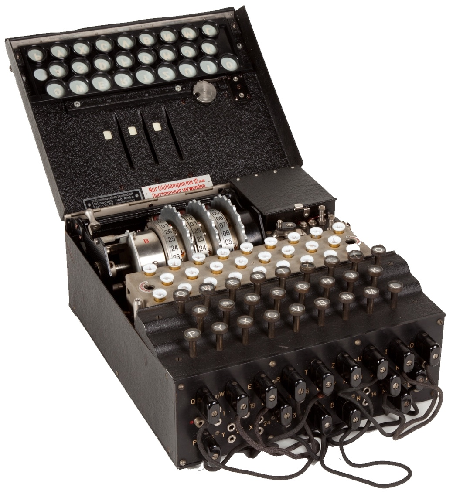
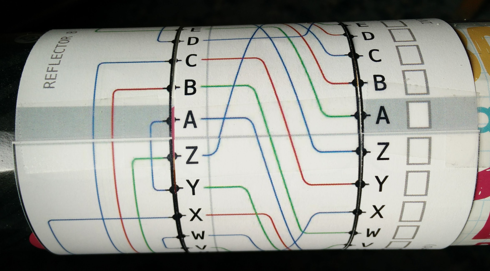

The Enigma
===========

.. index::
   single: Alan Turing
   single: Enigma
   single: World War II
   single: Bletchley Park

*Enigma*\ [#]_ was the name of a typewriter-like cryptographic machine that
was used by Germany before and during World War II. German military
commanders used the Enigma to encrypt instructions sent by radio to
their commanders across Europe and the Atlantic ocean. The Allies
could eavesdrop on the radio transmissions and hear the encrypted
messages, but without the key used for that day, they couldn't decrypt
them. A top-secret team of mathematicians were gathered in Bletchley
Park, England, with the task of breaking the Enigma. The team's
intellectual leader was a young man named Alan Turing. The story of
how the Enigma was broken is told pretty well in the movie *The
Imitation Game*, and even better (but without Benedict Cumberbatch) in
the book *Alan Turing: The Enigma* by Alan Hodges. Alan Turing's life
ended tragically due to how homosexual people were treated at the time\ [#]_.
In addition to ending WWII early, Alan Turing is credited with inventing
the modern computer and artificial intelligence.

.. [#] Photo by Alessandro Nassiri of the Enigma machine located at
       the Museo scienza e tecnologia in Milano, Italy, from
       Wikipedia.

.. [#] The British government issued a formal pardon and apology in 2013.

In the next two chapters you will learn how to build and use a cardboard model of the
Enigma that is compatible with the original. Then, step by step, we'll
implement the Enigma in Cryptol, and use it to encode and decode
messages.

.. TODO: finally, we'll use Cryptol's advanced features to break the enigma code.

Using a real Enigma
-------------------

If you ever get a chance to visit the National Cryptologic Museum\ [#]_, you
can use a real Enigma machine. Here's what you would do to encrypt
something with a real Enigma machine.

.. [#] The National Cryptologic Museum is next to Fort Meade, in
   Maryland, where the US National Security Agency is located. It's well worth
   visiting. It's about halfway between Washington D.C, and
   Baltimore.

First, the key is the combination of two things: the *rotor settings*
and the *plugboard settings*. The rotors are the wheels at the top of
the machine. Choose a set of initial positions and write them down.
You probably will not be able to change the plugboard settings, but
write them down (or take a photo) if you can. After you configure the key, then you
start typing your message. As you type, the machinery moves, and
lights up letters in the area above the keyboard. As you type the
message, a partner writes down the sequences of lit-up letters. This
is the encrypted message. As you type, the rotors change positions, so
if you want to immediately decode the message, you'll need to reset
the rotor, then you start typing in the ciphertext. If things are
working right, the plaintext of your message will show up in the
lights.

Making and using your own Enigma
---------------------------------

Franklin Heath, a cybersecurity company in the UK, released an
excellent cardboard model of the Enigma\ [#]_. It is similar to a
pen-and-paper version of the Enigma designed by Alan Turing while he
was at Bletchley Park, and can be used to encrypt and decrypt messages
interchangeably with real Enigma machines.

.. [#] You can download it from http://wiki.franklinheath.co.uk/ index.php/Enigma/Paper_Enigma

The first thing you'll need to assemble your own paper Enigma is a
tube that has a diameter of 75mm. One source of such tubes is
Pringles cans (they call them "crisp tubes" in Britain). If you don't
want to buy a can of Pringles, you can make your own tube from
cereal box cardboard.

Let's build our paper Enigma step by step, and write Cryptol code that
simulates the system at each step.

Following the directions on the Franklin Heath paper Enigma wiki,
build the most simple Enigma, which has three paper bands: the
Input/Output band, Rotor I, and Reflector B. Make sure to line up the
gray bar on the Reflector and the I/O band, and tape those bands
stationary, while allowing the rotor to move. The key in this Simple
Enigma is the letter between the gray bars when you start. Before
decoding each character, slide the rotor toward you one position, so
the next higher letter in the alphabet is between the grey bars.

   Paper Enigma with one rotor

Using this one-rotor setup, set the key to A, and decode the following
message:

..

  ``YMXOVPE``

I'll walk you through decoding the first letter:

 #. First, advance the rotor so that ``B`` is between the grey bars.

 #. Next, start at the ``Y`` on the INPUT/OUTPUT ring on the right.

 #. Trace from the ``Y`` along the blue line to the ``J`` on the rotor.

 #. Along the reflector, go from the ``J`` along the blue line up to the
    ``Q``.

 #. From the ``Q``, follow the red line across and down to the ``G``.

 #. ``G`` is the first decoded character! Now advance the rotor so that
    ``C`` is between the grey bars, and decode the next letter.

.. GOODJOB is the decoded message

The result should be two English words. If it isn't, make sure you're
advancing the rotor between each character. When you're done, ``H``
should be the character between the grey bars.

Implementing the Enigma in Cryptol
-----------------------------------

The Enigma is way more complicated than the Caesar or
Vigenere ciphers. We can't just implement it in one go - instead we
have to break it up into the various components and test each step as
we go. We'll start by implementing just the rotor, then the reflector,
then combine them into a one-rotor Enigma, and so on. Let's go!

Implementing Enigma rotors in Cryptol
~~~~~~~~~~~~~~~~~~~~~~~~~~~~~~~~~~~~~~

If you look at what the Enigma rotor does, it takes a letter as input
and shifts that letter to another location on the cylinder. The figure
below shows a part of Rotor I. If you put the rotor's ``A``
between the grey bars, you can trace out what each letter gets
transformed to. For example, ``A`` from the I/O band goes up four
positions to ``E``, and ``D`` goes up two positions to ``F``.
Because the rotors rotate\ [#]_, it makes sense to think about the
rotors in terms of offsets, or *relative* translations instead of
letters, or *absolute* addresses, like we did with the Caesar
cipher.

.. [#]

   Rotors were well-named, weren't they?

.. figure:: figures/EnigmaOffsetsFwd.pdf
   :figclass: align-center
   :width: 7cm

   Tracing rotor offsets in the forward direction.

Already we're now talking about three different kinds of numbers: the
*ASCII code* for each letter, the *indexes* within the alphabet those
letters have, and now *offsets*, which is what we're calling the
distance between two letters. They're all numbers, but they have
different meanings, and we need to be careful that we don't mix them
up in the code. Here's an example of each of them:

   +-------+-------+--------+--------------------------------------------+
   | Char  | ASCII | Index  | Offset from Char :math:`\rightarrow`       |
   +       +       +        +----------+---------+------+-------+--------+
   |       |       |        |   ``A``  |  ``B``  | ...  | ``Y`` | ``Z``  |
   +=======+=======+========+==========+=========+======+=======+========+
   | ``A`` |  65   |  0     |     0    |   1     |      |  24   |   25   |
   +-------+-------+--------+----------+---------+------+-------+--------+
   | ``B`` |  66   |  1     |     25   |   0     |      |  23   |   24   |
   +-------+-------+--------+----------+---------+------+-------+--------+
   | ``C`` |  67   |  2     |     24   |   25    |      |  22   |   23   |
   +-------+-------+--------+----------+---------+------+-------+--------+
   |                           ...                                       |
   +-------+-------+--------+----------+---------+------+-------+--------+
   | ``X`` |  88   |  23    |     3    |   4     |      |   1   |   2    |
   +-------+-------+--------+----------+---------+------+-------+--------+
   | ``Y`` |  89   |  24    |     2    |   3     |      |   0   |   1    |
   +-------+-------+--------+----------+---------+------+-------+--------+
   | ``Z`` |  90   |  25    |     1    |   2     |      |   25  |   0    |
   +-------+-------+--------+----------+---------+------+-------+--------+

The offset representation is how we'll describe what each rotor does
in the code. To create the offsets for a rotor it's
convenient to trace the lines on our cardboard Enigma
and write down which *letter* each line goes to,
then write a *helper function* to take that representation and turn it
into the sequence of *offsets* we want.

To express this in Cryptol, we start with by tracing the lines for
each character in the alphabet. We write them down in the same order,
so the first character is what the line from ``A`` goes to, which is
``E``. ``B``'s line goes further up, to ``K``, and so on. In your
``enigma.cry`` file, create a variable called ``rotorIchars`` like
this:

.. code-block:: console

  rotorIchars = "EK ..."

.. answer rotorIchars   = "EKMFLGDQVZNTOWYHXUSPAIBRCJ"

Where you fill in the rest of the string.

Our next job is to write a helper function that
computes each offset. We also choose to represent offsets with a
different number of bits than characters, so we (and Cryptol)
can tell them apart from each other. We *could* use 8 bits for
characters, indexes and offsets, but using different numbers of bits
for each of them makes it easier for Cryptol to help prevent
us from getting them confused, by giving us an error when we provide
one kind of number when a function expects another.

.. literalinclude:: cryptol/threeRotors.cry
   :language: cryptol
   :start-after: BeginBasicTypes
   :end-before: EndBasicTypes

The main tricky bit in this part of the program is that we need to
avoid negative numbers, because they won't work with Cryptol's modulo
arithmetic [#]_.  Fortunately, that's easy to do. Let's work through how to
compute offsets using only positive numbers. First, as we're marching
through the ``chars`` sequence, the offset between each character
``c`` and its position in the alphabet ``a`` is ``c - a``. This is a
positive number when the line goes up on our rotor. For example,
computing the very first entry, ``'E' - 'A'`` equals 4, just like we'd
hope.

.. [#] if you type ``-3 % 26`` in Cryptol, you get ``3`` instead of
       ``23`` like we'd hope. Python gets this right, but C, Java and
       many other languages get it wrong (they usually say -3).
       It's always safe to keep things positive like we're doing here.

.. index::
   single: modulo arithmetic

However, looking up the rotor at ``G``, we get ``'D' - 'G'``
which is -3.  How do we fix this? Well, it's always safe to add 0 to
something -- doing that doesn't change the result, right? In modulo
arithmetic, there are a *bunch* of numbers whose values are 0. For
example, ``26 % 26`` is ``0``, and so is ``52 % 26``. So if we add
``26`` to our element of ``chars`` before subtracting, that's the same
as adding zero, and we also know that the result will be positive.

So, our final expression for computing the offset from our array is
``c + 26 - a``. We do ``drop`{2}`` of that to take the 8 bit number
and drop the two leading ``0``'s from it. Think about whether it's
always safe to assume there will be at least two leading ``0``'s in
this number.

To test your function, try loading your program and running it, like
this:

.. code-block:: console

    % cryptol enigma.cry
    ... (Cryptol talking to you)
    Main> :set base=10
    Main> stringToOffsets rotorIchars
    [4, 9, 10, 2, 7, 1, 23, ... ]

If you get a different sequence of numbers, first decide if you agree
with the offsets above, and if you do, figure out why your function
doesn't do the same thing.

Exercise: write ``applyOffsetToIndex``
~~~~~~~~~~~~~~~~~~~~~~~~~~~~~~~~~~~~~~~~~~~~~~~~~~~~~~~

To apply an offset to an index *i*, we use this recipe: first, look
up the offset in the offset sequence using the ``@ i`` indexing
operator. To add two numbers, they need to have the same number of bits,
so prepend a ``0b0`` to the front of the offset using the ``#`` operator.
Then we add the result to ``i`` and apply ``% 26`` to get the new index.

Following this recipe, write a function called ``applyOffsetToIndex`` that has the following
type:

.. code-block:: cryptol

    applyOffsetToIndex : [26]Offset -> Index -> Index
    applyOffsetToIndex offsets i = <fill this in...>

    Main> let rIoffs = stringToOffsets rotorIchars
    Main> applyOffsetToIndex rIoffs (charToIndex 'A')
    Main> applyOffsetToIndex rIoffs (charToIndex 'Z')
    Main> applyOffsetToIndex rIoffs (charToIndex 'Y')

Does your code agree with the cardboard Enigma?

.. TODO - ANSWER::

   applyOffsetToIndex o i = (i + (0b0 # o@i)) % 26

   Enigma> applyOffsetToIndex rIoffs (charToIndex 'A')
   0x04
   Enigma> applyOffsetToIndex rIoffs (charToIndex 'Z')
   0x09
   Enigma> applyOffsetToIndex rIoffs (charToIndex 'Y')
   0x02

Implementing the reflector in Cryptol
~~~~~~~~~~~~~~~~~~~~~~~~~~~~~~~~~~~~~

Now let's look at the Reflector. The main thing different between this
and the rotor is that the lines loop back to the edge they start from.

.. figure:: figures/ReflectorOffsets.pdf
   :figclass: align-center
   :scale: 40%

   A portion of Reflector B.

Here, we see that ``I`` goes to ``P``, ``K`` goes to ``N`` and so on.
Just as we did for the rotor, follow the lines and come up with the
Cryptol string that represents the Reflector's actions. It should
start like this:

.. code-block:: console

  reflectorBchars = "YRU // ... finish the rest

.. answer: "ABCDEFGHIJKLMNOPQRSTUVWXYZ"
   ->      "YRUHQSLDPXNGOKMIEBFZCWVJAT"

We can now reuse our code from the rotors to compute the offsets in
the reflector, like this:

.. code-block:: console

  reflectorBoff = stringToOffsets reflectorBchars

Now test your reflector and your ``applyOffsetToIndex`` function:

.. code-block:: console

    Main> indexToChar (applyOffsetToIndex reflectorBoff (charToIndex 'P'))
    'I'
    Main> indexToChar (applyOffsetToIndex reflectorBoff (charToIndex 'O'))
    'M'
    Main> indexToChar (applyOffsetToIndex reflectorBoff (charToIndex 'K'))
    'N'

Looking at the figure, indeed ``P`` :math:`\rightarrow` ``I``,
``O`` :math:`\rightarrow` ``M`` and ``K`` :math:`\rightarrow` ``N``.
Go ahead and test it on ``A``, ``B`` and ``C`` and compare it with
your Enigma to increase your confidence.

Going reverse through the rotor
~~~~~~~~~~~~~~~~~~~~~~~~~~~~~~~

.. index::
   single: self-inverting function

Because of the way the reflector works, if ``I`` :math:`\rightarrow`
``P``, we know the reverse is also true: ``P`` :math:`\rightarrow`
``I``. This kind of transformation is called a *self-inverting
function*. You may have already noticed that the rotors are *not*
self-inverting. Looking at Rotor I, going in the forward direction,
``A`` :math:`\rightarrow` ``E``, but going from left-to-right, ``E`` goes off the top of the
figure to ``L``. So towards the goal of implementing a one-rotor Enigma,
we're 2/3rds of the way there: we can go forward through the rotor,
then through the reflector, and now what we need to do is go backwards
through the rotor. Since the rotor is *not* self-inverting, we'll have
to compute the backwards function.

We could go through, one by one, and produce another string that
represents the backwards transformation. However, we already have the
information we want in the previous ``rotorIchars`` string. Look at
this:

.. code-block:: console

  alphabet    = "ABCDEFGHIJKLMNOPQRSTUVWXYZ"
  rotorIchars = "EKMFLGDQVZNTOWYHXUSPAIBRCJ"
                 ^- shows E -> A     ^- shows A -> U

In the forward direction, this shows us ``A`` :math:`\rightarrow`
``E``.  It also tells us the backwards-mapping too: because ``E`` is
in the first position, that tells us that in the reverse direction
``E`` :math:`\rightarrow` ``A``. Because ``K`` is in the second
position, we know ``K`` :math:`\rightarrow` ``B``. We can follow this
pattern to automate the process of reversing this operation in
Cryptol! It's a bit tricky, so we'll go carefully:

.. literalinclude:: cryptol/threeRotors.cry
   :language: cryptol
   :start-after: BeginIndexOf
   :end-before: EndIndexOf
   :linenos:

.. index::
   single: recursion
   single: permutation
   single: sequence comprehension
   single: where

The first function we want is one that gives us the index of a
character in a permutation. Line 1 defines our function, and says
that it returns the last item of a sequence called ``candidates``. The
``where`` says we're about to define some variables (in this case only
one). Line 2 says that ``candidates`` is a sequence that starts off by
concatenating the sequence of one element (``[-1]``) with a *sequence
comprehension* (remember those from Chapter 3?). Each element of the
sequence is the result of an if statement: if ``c == s`` it's ``i``
otherwise it's ``p``. We don't yet know what any of those variables
(except ``c``) is yet, but fear not: they're defined right below. Line
3 says that ``s`` *is drawn from the elements of permutation*. So each
time through the loop, ``s`` is the next element of the permutation. Line
4 says that ``p`` is drawn from the elements of the ``candidates``
sequence. Interesting: We're using the sequence in the definition of
itself! Just like in Chapter 3, this is an instance of *recursion*.
Finally, line 5 says that ``i`` is drawn from the sequence ``[0..25]``.

When this function runs, it builds up the ``candidates`` sequence,
starting with ``-1``, each element keeps being set to ``p`` (which
starts out with ``-1``) until the letter from permutation being examined,
called ``s`` is equal to ``c``, the letter we're searching for. When
that happens, the new element of ``candidates`` gets set to ``i``,
which is the index of the match, because the numbers ``0 .. 25`` are the
indexes of the elements of shuffled sequence.

Here are the values of candidates as it proceeds through the
string, with the call ``findIndex 'L' rotorI``:

.. code-block:: console

   c: 'L'
   i:           [ 0,  1,  2,  3,  4,  5,  6, .., 25 ]
   candidates = [-1, -1, -1, -1,  4,  4,  4, .., 4  ]
   s:             E   K   M   F   L   G   D  ... J
   note:          s == 'L' here:  ^   so the index i
                  (4) is saved to candidates

With this function, we can create the left-to-right version of a rotor
given its right-to-left version:

.. literalinclude:: cryptol/threeRotors.cry
   :language: cryptol
   :start-after: BeginInvertPermutation
   :end-before: EndInvertPermutation

Save these functions and the definition of ``rotorIchars``, ``reflectorBchars`` and
``alphabet`` to a file called ``enigma.cry``, and run Cryptol on it:

.. code-block:: console

  $ cryptol enigma.cry
                          _        _
     ___ _ __ _   _ _ __ | |_ ___ | |
    / __| '__| | | | '_ \| __/ _ \| |
   | (__| |  | |_| | |_) | || (_) | |
    \___|_|   \__, | .__/ \__\___/|_|
              |___/|_|  version 2.4.0

  Loading module Cryptol
  Loading module Main
  Main> :set ascii=on
  Main> let rotorIrev = invertPermutation rotorIchars
  Assuming a = 7
  "UWYGADFPVZBECKMTHXSLRINQOJ"
  Main> rotorIrev @ asciiToIndex 'C'
  'Y'
  Main> invertPermutation reflBchars == reflBchars
  True

Indeed, going from left-to-right (backwards), ``C`` goes to ``Y``.
Pretty cool, isn't it? We worked hard to write this code to save us the hassle of
manually tracing the letters backwards. The benefit of doing it this
way instead of by hand is that we have confidence that the
backwards version of the rotors is actually correct. A single typo in
the string would result in an error that would be really hard to track
down. Finally, at the end, we tested whether the reflector is
its own inverse permutation, and indeed it is.

.. TODO: In a future chapter, we'll learn how to use Cryptol to prove
   properties about our rotors, such as that they are permutations of the
   alphabet, and the inverse rotor actually does invert its input.

   aside: add a discussion about permutations/shuffles vs.
   sequences of random numbers. Key point: invertability

Combining the Rotor and Reflector
~~~~~~~~~~~~~~~~~~~~~~~~~~~~~~~~~~

Now we can combine the functions you've written so far
into an implementation of a one-rotor Enigma:

.. literalinclude:: cryptol/threeRotors.cry
   :language: cryptol
   :start-after: BeginOneChar
   :end-before: EndOneChar
   :linenos:

There's a lot of code here, so let's go through it line by line:
Lines 5 and 6 define the type of
``encryptOneChar``, and lines 7 and 8 define the name of the function
and its arguments. We say here that the output of the function is
``outputChar``, but the ``where`` means we're defining ``outputChar``
and other variables in the following indented lines. Line 9 defines
``inputIndex`` to be the index of our input character (e.g., ``A``
would be 0). Next we define ``afterRI`` to be the index of the
character after passing through Rotor I. Similarly, ``afterRefl`` is
the index after passing through the Reflector. Finally,
``outputIndex`` is the index after going through ``rotorRev``.
Finally, we convert ``outputIndex`` into our ``outputChar`` by using
the well-named ``indexToChar`` function.

Moving down to the ``encryptOneRotor`` function, it returns a sequence
comprehension, which applies ``encryptOneChar`` to all of
the characters of ``message``. In parallel with those characters, we
have an index variable ``i`` go from ``1 .. 100``, and we rotate the
``rotorOff`` and ``rotorRevOff`` by that many steps, to simulate how
we rotate the rotors before encrypting each character. The ``where``
at the end of the comprehension says we define the various sequences
afterwards. The most tricky bit here is that we compute the
``rotorRev`` from ``rotor`` by using the ``invertPermutation``
function we wrote earlier. The rest of the variables are just the
result of applying ``stringToOffsets`` to create the offset versions
of the rotors, which are what our ``encryptOneChar`` function needs.

Now we can test it with the exercise from Section 5.2:

.. code-block:: console

  Main> encryptOneRotor rotorIchars reflBchars "YMXOVPE"
  Assuming a = 7
  "GOODJOB"

Pretty amazing! One limitation of this implementation is that it can
only handle messages up to 100 characters long. That, and it's missing
a few features from our paper Enigma. We'll take care of those in the
next chapter.
