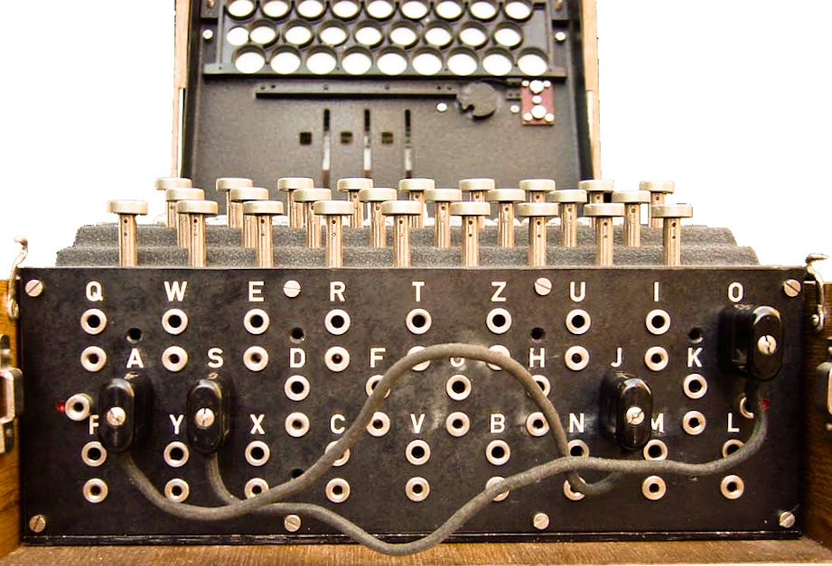

Completing the Enigma in Cryptol
================================

.. maybe-note:  *This chapter can be skipped the first time through if you're
  impatient. The Enigma is really cool, though, and there are some
  neat programming techniques in here, so make sure you come back to
  this chapter later on.*

Compared to our paper Enigma (and the real thing), our Cryptol version
lacks:

#) Multiple rotors,

#) *pins* that control stepping the rotors,

#) the *rings* that control where the pins start, and

#) the *plugboard,* which modifies the I/O ring.

Let's implement them!

Combining multiple rotors
--------------------------

Get our your paper Enigma and set Rotor II and Rotor
III to ``A``. Then for each of them, trace, from the right towards the left, each
letter from ``A .. Z`` just like we did for Rotor I in the
previous chapter. Starting with Rotor II (the middle one), you'll
see that the line from ``A`` goes straight across to ``A``, so
the first letter in that rotor is just ``A``.

As a starting point, here are the first few entries for rotors ``II``
and ``III``:

.. code-block:: console

   rotorIIchars  = "AJD ..."
   rotorIIIchars = "BDF ..."

Once you complete the rotor strings, the next job is to combine them
in the encryption function. One annoying thing that you may have noticed in our
``encryptOneRotor`` function is when we had to individually rotate the
``rotorOff`` and ``rotorRevOff`` sequences. Let's create a data
structure that lets us deal with an entire rotor (and its reverse) at
the same time:

.. literalinclude:: cryptol/threeRotors.cry
   :language: cryptol
   :start-after: BeginRotorType
   :end-before: EndRotorType

.. index::
   single: tuple

This declares ``RotorElement`` to be a *tuple*, which is a
comma-separated list of items inside parentheses. Unlike a sequence,
whose elements all have to be the same type, the elements of a tuple
can have different types--in this case, ``Offset`` and ``Bit``. The ``Bit`` at the
end is for the Rings, which we'll deal with in the next section.
To create a rotor from the characters we carefully traced, we need a helper function,
``buildRotor``:

.. literalinclude:: cryptol/threeRotors.cry
   :language: cryptol
   :start-after: BeginRotorDef
   :end-before: EndRotorDef

.. index::
   single: refactor

Returning to how the multi-rotor Enigma works, and thinking about
what we've written so far, our one-rotor Enigma is the left-hand half
of the 3-ring Enigma: the Reflector and first Rotor. We need to add
two more rotors to it. It's not quite as simple as that, though,
because our ``encryptOneRotor`` function takes a Char as input, and
returns a Char as output, but if we want to connect our rotors
together, the type of data that flows between them is ``Index``, not
``Char``. So we'll need to *refactor* our code a bit so that it's more
modular.

.. literalinclude:: cryptol/threeRotors.cry
   :language: cryptol
   :start-after: BeginReflectorDef
   :end-before: EndReflectorDef

Let's start with
our function that implements one rotor and the reflector.
If we want to add another rotor to our Enigma, we can call our
``doOneRotor`` function as a helper. First we go through our new
rotor forwards, then call the ``doOneRotor`` function, then use the
output of that, and go through our rotor backwards.

Exercise: write the three rotor function
~~~~~~~~~~~~~~~~~~~~~~~~~~~~~~~~~~~~~~~~
Follow the pattern established above, and write ``doThreeRotors``.
It should start off like this:

.. code-block:: console

   doThreeRotors refl r1 r2 r3 c =

Make sure you use ``doTwoRotors``, and keep track of how many
arguments it takes and what they are.

.. answer:
   doThreeRotors refl r1 r2 r3 i =
       doRotorRev r3 (doTwoRotors refl r1 r2
                     (doRotorFwd r3 i))

We can wrap this function with another function that translates a
``Char`` to ``Index`` and back again so that we can test our code:

.. code-block:: cryptol

    doOneChar c refl r1 r2 r3 =
        indexToChar ( doThreeRotors refl r1 r2 r3 (charToIndex c))

Now we can encode single characters with the three rotor Enigma code,
and compare it to our cardboard Enigma.
As a test, set all three rotors to ``A``, and make sure
that encoding ``A`` results in ``U``, and ``B`` goes to ``E``. If you
don't get those results, or if your program loads with errors, see if
you can figure out what's wrong with your version.

.. code-block:: console

   Enigma> doOneChar 'A' reflB rotorI rotorII rotorIII
   'U'
   Enigma> doOneChar 'B' reflB rotorI rotorII rotorIII
   'E'

Creating an Enigma state structure
----------------------------------

.. index::
   single: record

Since the Enigma state consists of a number of different things, it's
going to be convenient to create a *record* to describe it.  A record
is like a tuple but with named elements. Here's the declaration of our
Enigma state record:

.. literalinclude:: cryptol/threeRotors.cry
   :language: cryptol
   :start-after: BeginEnigmaStateDef
   :end-before: EndEnigmaStateDef

The ``EnigmaState`` record type combines all three rotors and the reflector
into a single *object*. If we had a variable of this type named
``enigmaState``, we could access its rotors with this syntax:
``enigmaState.rotors``. Similarly for ``plugboard``.
The part about the ``plugboard`` will be explained near the end of
this chapter.

Stepping the rotors
-------------------

Now that we have all three rotors going, our next step is to advance
them before encoding each character. Let's start by describing in a
bit more detail what the *advance rotors* function needs to do:

First, there are pins attached to each rotor. We're representing the pins
as the ``Bit`` in the ``Rotor`` data type. When the pin at
position 0 of the rotor is True, we need to
follow these rules:

 * If the middle rotor's pin is True, we advance all three
   rotors, otherwise
 * if the pin furthest from the reflector (rotor 3) is True
   we advance rotors 2 and 3, otherwise
 * just advance rotor 3.

Here's code that implements these rules, along with the helper
function ``getPins``:

.. literalinclude:: cryptol/threeRotors.cry
   :language: cryptol
   :start-after: BeginRotationsDef
   :end-before: EndRotationsDef

The function ``getPins`` has some tricky indexing, so here's an
explanation, step by step:

 #) ``rs@0`` is the first rotor (type: ``[26](Char,Bit)``)
 #) ``(rs@0)@0`` is the first element of the first rotor, type: ``(Char,Bit)``
 #) ``((rs@0)@0).0`` is the character part of that first element, type: ``Char``
 #) ``((rs@0)@0).1`` is the Pin part of that first element, type: ``Bit``

Now we can write ``advanceRotors`` that applies these rules to our
rotors:

.. literalinclude:: cryptol/threeRotors.cry
   :language: cryptol
   :start-after: BeginAdvanceDef
   :end-before: EndAdvanceDef

Before we can test the function, we need to have some pins in
our rotors. Looking at the cardboard Enigma, each rotor's pin is at the
position where the letter has a grey background. So Rotor I's pin is
at ``'Q'``, Rotor II's pin is at ``'E'`` and Rotor III's pin is at
``'V'``. So all we need to do is pass to ``buildRotor`` a sequence of
bit's with the bit set accordingly. Here's a helper function that will
make that easy:

.. literalinclude:: cryptol/threeRotors.cry
   :language: cryptol
   :start-after: BeginPinsDef
   :end-before: EndPinsDef

.. index::
   single: zero
   single: or operator

You might be surprised by the definition of ``setBit``. Our goal is to
take a ``1`` in position 0, and use the *shift* operation (``>> b``),
to move it ``b`` spots to the right. So we first need a ``1`` in the
first position.  There are many ways to achieve this\ [#]_. The way
this function does it is by taking a ``1`` in the least significant
position, and rotating it one position to the right (``>>> 1``), which
wraps it around to the most significant place, which we then shift
``b`` positions to the right. Finally we use the *or* operator,
``||``, to overlay our newly set bit with our input ``n``.

.. [#]

   Another way to achieve it would be to write ``(0b1 # zero)``. Since
   Cryptol knows how many bits the result needs to have, it will
   stretch ``zero`` to have the right number of ``0`` bits after the
   ``0b1`` to work out.

The other interesting thing about this code is the use of ``zero``.
It's a built-in Cryptol ``0`` constant that can have any type. In this
case, it's a sequence of as many ``False`` bits as we need to
initialize our empty pins.

Now we have enough functions to build a sequence of rotor positions that follow
the Enigma's rules:

.. literalinclude:: cryptol/threeRotors.cry
   :language: cryptol
   :start-after: BeginRotorStates
   :end-before: EndRotorStates

Exercise
~~~~~~~~

You can now build most of an Enigma state, including rotors with the
pins.  We can feed that starting state to ``enigmaStates`` to get an
infinite sequence of states, which are the states after following the
``advanceRotors`` rules for each step.  If drop the first 99 states of
that sequence, you'll see the sequence of states just before and after
a pin shows up in position 0 of Rotor II, so run this:

.. code-block:: console

  Enigma> let startState = buildEnigmaState rotorI rotorII rotorIII reflB zero
  Enigma> drop`{99} (enigmaStates startState)
  [{rotors = [[(0x04, 0x14, False), (0x09, 0x15, False),
  ...

Explain how the sequence of ``Rotor`` states do, or do not, follow the
rules for rotor advancement.

Implementing the plugboard
--------------------------

Here's how the plugboard works on the cardboard Enigma:
to configure the plugboard, you're given pairs of letters, like
``"AP"`` and ``"BR"``. In the little boxes on the I/O Ring, you write
a ``P`` next to the ``A`` and write an ``A`` next to the ``P``, and so
on. Then, when you're about to encode a letter, you first check if
there's a letter in the box, and if there is, you hop over to the
corresponding letter on the ring, and start encoding from there.
Similarly on the way back after the reflector and the rotors, you
return the letter in the box (if there is one) when you finish
following the lines.

It's easiest to construct the plugboard as a
string that starts out as the alphabet in order (which is the same
as a *empty plugboard*), and for each pair of letters in the
plugboard's definition, swap those letters in the string.  Here's a
helper function that does that:

.. literalinclude:: cryptol/threeRotors.cry
   :language: cryptol
   :start-after: BeginPlugboardDef
   :end-before: EndPlugboardDef

.. index::
   single: recursion

This function uses a different kind of recursion than we've used
before. Rather than recursion based on elements of a sequence,
we're calling our ``buildPlugboard`` function in its own definition,
but with a bigger value for ``i`` each time around. Finally it ends
when ``i`` is greater than or equal to the number of elements in our
``swaps`` sequence. Cryptol's built-in ``width`` function tells us how
many elements there are in ``swaps``.

Finally, to use the plugboard, even though its operation is simple,
it's also subtle: in the forward direction, its input is a ``Char``,
but its output is an ``Index``. In the reverse direction, its input is
an ``Index``, but its output is a ``Char``.

Exercise: Testing the plugboard
~~~~~~~~~~~~~~~~~~~~~~~~~~~~~~~

Implement the ``doPlugFwd`` and ``doPlugRev`` functions, which have
these types:

.. code-block:: cryptol

   doPlugFwd : CharPerm -> Char -> Index

   doPlugRev : CharPerm -> Index -> Char

It's subtle, but all you should need are the *indexing operator* ``@``
and our helper function from before, ``charToIndex``.

As an aside, you've probably noticed the Cryptol prompt always says
``Main>``. If you want, you can start your ``enigma.cry`` file with
the following line, which will change the prompt to ``Enigma>``, which
is pleasing (to me, at least):

.. code-block:: cryptol

  module Enigma where

When you're done, test your function with an empty plugboard, as well
as with the cardboardEnigma example plugboard, which is defined by
this sequence of character pairs:

.. code-block:: cryptol

   franklinHeathPlugboard = buildPlugboard
       ["AP","BR","CM","FZ","GJ",
        "IL","NT","OV","QS","WX"]
       alphabet 0

   // save the above to your enigma.cry,
   // and then in Cryptol:

   Enigma> set ascii=off
   Enigma> doPlugFwd franklinHeathPlugboard 'A'
   0x0f
   Enigma> doPlugFwd franklinHeathPlugboard 'X'
   0x16
   Enigma> set ascii=on
   Enigma> doPlugRev franklinHeathPlugboard 0
   'P'
   Enigma> doPlugRev franklinHeathPlugboard 25
   'F'

Assembling our parts into an Enigma
-----------------------------------

We now have the components required to write a function that encrypts
a single character, by going through the plugboard, then the three
rotors and reflector, and back through the plugboard:

.. literalinclude:: cryptol/threeRotors.cry
   :language: cryptol
   :start-after: BeginDoOneChar
   :end-before: EndDoOneChar

And now we can use our well-worn technique of constructing a sequence
of encrypted characters by applying ``doOneChar`` to each character of
the input, in parallel with each state of the Enigma machine:

.. literalinclude:: cryptol/threeRotors.cry
   :language: cryptol
   :start-after: BeginDoEnigma
   :end-before: EndDoEnigma

The reason we drop the first state of our ``enigmaStates`` is that
when you use the Enigma, you're supposed to advance the rotors *before*
encrypting each character.

Exercise: Testing the plugboard, three rotors and reflector
~~~~~~~~~~~~~~~~~~~~~~~~~~~~~~~~~~~~~~~~~~~~~~~~~~~~~~~~~~~

We can now test the basic
functions of the Enigma. First, we'll create a start state
corresponding to the initial rotor positions ``AAA``:

.. code-block:: cryptol

    aaaEnigmaState = buildEnigmaState
        rotorI rotorII rotorIII reflB
        franklinHeathPlugboard

    // and another state with an empty plugboard:
    noPlugboardState = buildEnigmaState
        rotorI rotorII rotorIII reflB
        alphabet

Then, in Cryptol, we can encrypt and decrypt a test message:

.. code-block:: console

   Enigma> doEnigma aaaEnigmaState "WOWITWORKS"
   "JLBDMQCLQZ"
   Enigma> doEnigma aaaEnigmaState "JLBDMQCLQZ"
   "WOWITWORKS"

If it works, congratulations! If it doesn't, it's most likely your
plugboard, and you can test things with
an empty plugboard like this:

.. code-block:: console

    Enigma> doEnigma noPlugboardState "WOWITWORKS"
    "KIYQXAMTSO"

If that doesn't work, manually check your ``doOneRotor`` and
``doTwoRotor`` functions against your cardboard Enigma, to make sure
things are working that far.

Finishing touches
-----------------

All we have left before our Enigma is complete is to implement
adjustable rings, and being able to set the initial rotor positions
according to a three-letter *key*. Let's do it!

Implementing adjustable rings
~~~~~~~~~~~~~~~~~~~~~~~~~~~~~

Install the rings on your cardboard Enigma.  Some descriptions of the
Enigma describe a ring position by which letter on the ring covers up
the ``A`` on the rotor underneath. Other descriptions specify the
index\ [#]_ of the character covering the rotor's ``A``. Fortunately,
it's easy for us to do either. Let's look at a very simple ring
adjustment: set Rotor III's ring so that the ring's ``A`` covers the
rotor's ``B``.  Look at what they do, and think about how to implement
that in your program. Here are some attributes of the rings that you
might notice:

 #) They repeat the alphabet that's on the rotor underneath,
 #) which *character* has a gray background is fixed, per rotor, and
 #) when you slide the ring around, the characters and the pin move
    relative to the lines on the rotor.

.. [#]

   Usually instead of specifying the 0-based index, they specify the
   1-based "which letter of the alphabet" (A :math:`\rightarrow` 1), which is just the
   *index plus 1*. Which is also easy for us to compute.

From these observations, it that setting the rings should consist of rotating
the offsets and the pins in one direction or the other. Let's
figure out which direction the offsets get rotated
according to a ring position.

Start by creating a new version of ``buildRotor`` that includes
a ``ring`` parameter:

.. code-block:: cryptol

   buildRotorRing rChars pins ring = [ (of, ob, p)
                                     | of <- fwd
                                     | ob <- rev
                                     | p <- pins
                                     ] where
       fwd      = (stringToOffsets rChars) ??? ring
       revChars = invertPermutation rChars
       rev      = (stringToOffsets revChars) ??? ring
       //                                    ^^^
       //               should these be >>> or <<<?

To figure out which direction to rotate the ``fwd`` and ``rev`` sequences, try
it with our cardboard Enigma: set the ring's ``B`` to cover the
rotor's ``A``, and align the ring's ``A`` with the ``I/O ring``'s A.
See what happens to the translation, compared to before.

If that helps you enough to decide, go ahead and complete and add this
function to your ``enigma.cry``.  If you need more help, try comparing
the output of ``doRotorFwd``, with rotors constructed both ways, to
what your cardboard Enigma does.

Once you've added your version of ``buildRotorRing``, you can test it
by building an ``enigmaState`` that uses those rotors, like this:

.. code-block:: cryptol

   rotorI   = buildRotorRing rotorIchars pinsI (charToIndex 'J')
   rotorII  = buildRotorRing rotorIIchars pinsII (charToIndex 'N')
   rotorIII = buildRotorRing rotorIIIchars pinsIII (charToIndex 'U')

   testState = buildEnigmaState
                 rotorI rotorII rotorIII reflB
                 franklinHeathPlugboard

Then in Cryptol, run:

.. code-block:: console

   Enigma> :set ascii=on
   Enigma> doEnigma testState "ALMOSTDONE"
   "YXRJLPTZWS"

If you don't get that result, check the output of one rotor:

.. code-block:: console

   Enigma> :set ascii=off
   Enigma> doRotorFwd rotorIII 0
   0x01

Setting the key
~~~~~~~~~~~~~~~

The configuration of the Enigma corresponding to a *key*
consists of rotating each rotor in the start state so that the key's
letter is in position 0. We can pretty easily do that, again using the
rotate operator (``<<<``), an amount corresponding to the difference
between the key's index and ``'A'``. So, let's write a function that
takes an Enigma state and a key (``[3]Char``), and produces a new
Enigma state with the rotors set appropriately:

.. literalinclude:: cryptol/threeRotors.cry
   :language: cryptol
   :start-after: BeginSetKey
   :end-before: EndSetKey

Decoding some real Enigma messages
----------------------------------

Reviewing what we've done:

 #) we can build an ``EnigmaState`` corresponding to a sequence of
    rings, a reflector and plugboard using ``buildEnigmaState``,
 #) to change the key of a state from ``"AAA"`` to something else, we
    use ``setKey``, which takes a state and a key, and returns a new
    state.

The Franklin Heath website has an example Enigma message that has been
encoded with the Ring and Plugboard we've already created. All that's
left is to create the state and set the key, which you can do in your
``enigma.cry`` or at the Cryptol command line, like this:

.. code-block:: console

   Enigma> let state = buildEnigmaState rotorI rotorII rotorIII reflB franklinHeathPlugboard
   Enigma> let vqqKey = setKey state "VQQ"
   Enigma> doEnigma vqqKey "HABHVHLYDFNADZY"

What do you get?  It should be four words smooshed together. If that's
not what you get, go back through the various checkpoints in this
chapter to make sure you have the correct setup.

If it did work, try decrypting the following message, with the same
key as before: ``FONUGETQBLRQKHFESDSUFTEAHVZP``

Finally, if you've been working with a partner, each one of you come
up with a message (and maybe even a different key, plugboard, or rotor
orders), and describe the configuration to them sufficiently that they
can decode your message.

You may note that, just as in Chapter 1, the challenge with secure
communication has been transformed into a *key distribution* challenge.

