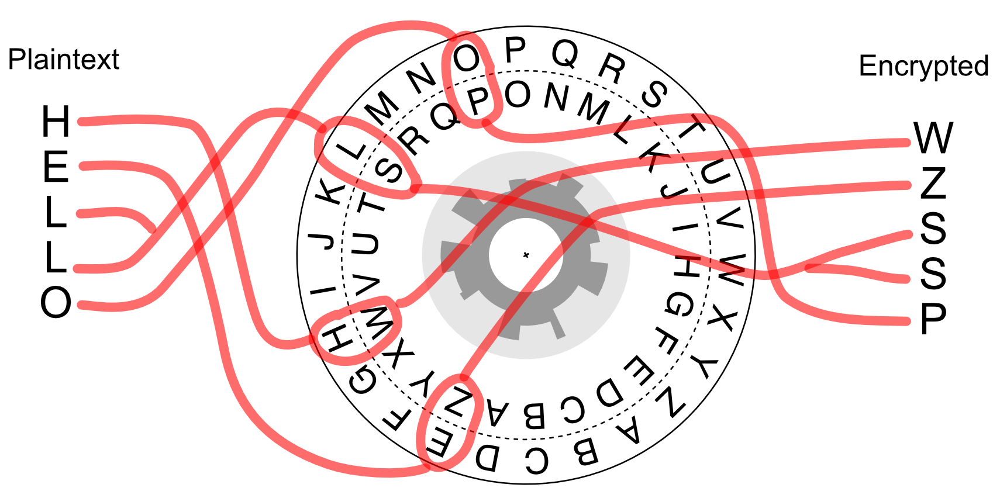

# Getting started

This book is a guide to learning about cryptography, the math that cryptography
is built on, and how to write programs that implement cryptographic algorithms.
Don't worry if any of that sounds too complicated: it's all explained inside.
Also don't worry if it sounds too boring: these topics are surprisingly deep
and interesting -- there's a lot of cool stuff even jaded students (of all
ages!) can learn.

At the beginning of each chapter, we'll describe what you'll know by the end of
the chapter.  If you feel like you already know that stuff, try skimming the
chapter (don't skip it!) to make sure that you do, and slow down and read the
new stuff.

At the end of this chapter you'll know what resources you'll need to complete
the activities in the book, and you'll have encrypted and decrypted a message
using the Caesar cipher.  Let's get going!

## What you'll need

You'll need a sense of curiosity. You'll also need a dedication to actually
doing the exercises: if you just read this material you'll only get a small
fraction of the benefit of doing.  You'll need access to a computer. It can be
a Windows, MacOS or Linux computer - they're all fine.

Having a group of people to work with is a good idea. A lot of the
activities require serious thought, and it's totally normal to get
stuck (often). If you work with a group of people, when one of you
gets stuck, the others can help out. Not by giving answers, but by
nudging in productive directions.  Often all it takes to do this is to
ask "What are you working on? What have you tried? Is there anything
you haven't tried yet?" Explaining the answers to these questions to
another person is often enough to get unstuck.

## Why cryptography?

Cryptography is the mathematics of secret messages. The popularity and
pervasiveness of social media has caused some people to comment
"nothing is secret any more." But is that really true?  People share
photos taken in restaurants all the time, but is it a good idea to
share a photo of the credit card you used to pay for your food? What
about sharing your social media passwords? Needless to say, privacy
and cryptography are both interesting, and are related to each other in
subtle ways.

## Let's get started

Print out and assemble the Caesar Cipher kit that comes with
the book.  The Caesar Cipher is one of the earlest known ciphers, used
by Caesar to communicate orders to distant generals. The idea is that
if the messenger was intercepted by foes of Caesar, that they wouldn't
learn any secrets from the message they carried.

Follow the instructions on the kit to decode the following punchlines:

I wondered why the ball was getting bigger ... (Use the key: J$\leftrightarrow$M)

`CORI NC ONC JR`

What do you call a counterfeit noodle? (Key: F$\leftrightarrow$O)

`TG LHETBAT`

A backward poet ... (Key: H$\leftrightarrow$H)

`SXGVKW GBTKXWK`

If you managed to decrypt all three of these, congratulations - that's a lot
of work! When I use a Caesar's Cipher wheel, it takes about 3 seconds per
letter to encrypt or decrypt a message. At that rate, it would take about an
hour to encrypt a whole page of text, which is way too long.

Given how tedious it is to decrypt, even when you know the key, it's not too
hard of a stretch to imagine Caesar thinking this cipher was good enough.
Now that we have computers, it's a lot easier to encrypt and decrypt
messages, and the Caesar Cipher is not close to good enough. We'll learn
about how "real world" cryptography works later in this book.

## Things to ponder

 1. you may have seen a Caesar Cipher whose inner wheel and outer
    wheel go in the same direction, but the one in this book has them
    going in opposite directions. What attributes do each version
    have? What advantages or disadvantages can you think between the
    two versions?

 1. if it took you one minute to try to decrypt a message using a key
    you guessed, how long would it take, on average, to decrypt a
    Caesar Cipher message whose key you don't know^[Hint: first, how
    many different possible keys are there? It's safe to guess that on
    average, you'll have to try half of them before guessing the right
    one.]? If it takes a computer 1 millisecond try one key on a
    message, how long, on average, would it take to decrypt a message
    without knowing the key?

 2. how much more secure would it be to have weird symbols (Greek
    letters or Egyption heiroglyphics), instead of letters, for the
    cyphertext in a Caesar's Cipher? Explain your answer.

 3. _key distribution_ is the challenge of getting the secret key to
    your friend. One way to distribute a key would be to include it in
    some hidden way in the message. Come up with a few ways you could
    do this with the Ceasar Cipher. Another way would be to agree on a
    shared key when in the same room as your friend. What are some of
    the advantages and disadvantages of these two approaches?

## Take-aways

You've thought about why cryptography is important. You know how to encrypt and decrypt messages using the Caesar Cipher. You have thought about how secure it is, including the aspects of key distribution.
